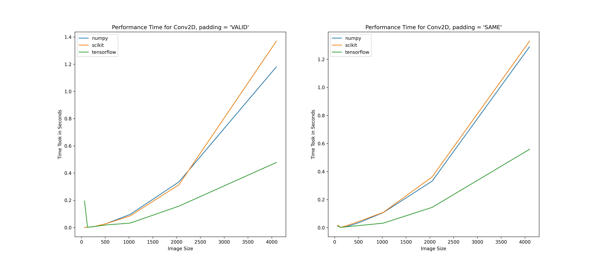

# conv2D_operation
This repository is a short study on the convolution operation with 3 different libraries and their timings in operation. The used libraries are numpy, scikit-image and tensorflow.

My goal was to understand the background of matrix vectorization and matrix multiplication that works behind every convolution operation. 

I have tested the time took to do the convolution with and without padding for different image sizes varying from 64 to 4096. I used CPU calculation only because tensorflow operation did not give reliable timing results due to initialization of tensor to gpu, do 1 calculation and write back to CPU. The goal of this study was not that also. I believe it could be a good starting point to understand what basically happens in a 2D convolution.

The terminal output shows the first 3 values of the convolved matrix and each image is randomly different. It can be observed that the output values are same, which makes the convolution reliable. The time it took to do the operation with different image sizes can be seen below. I have tried [64, 128, 256, 512, 1024, 2048, 4096] image sizes in an SxSx3 as "S" being one of the image size value.

I think the first longer time occurance of tensorflow operation in "VALID" padding is due to some initialization process of tensorflow. But later on, we can see that tensorflow generalizes better with a less steep curve compared to numpy and scikit-image with bigger image sizes.

I other thing I learned, which is different that tensorflow convolution operation is that, when padding is "SAME" and stride is not 1, the output of tensorflow operation differs than the numpy and scikit-image operation. The difference is in the values of pixels, that they are not identical. But the output is similar. I did the test on the lena_color.gif image with the same sobel filter used in here and both outputs are doing edge detection. Not identical pixel values are due to different padding of tensorflow. The detail I found from [this page](https://tcnguyen.github.io/neuralnetworks/cnn_tensorflow.html) shows the different approach of tensorflow.

